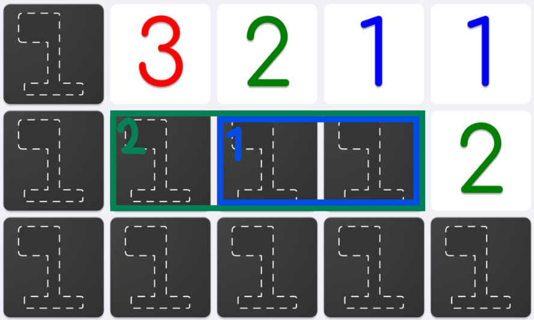

# 定義

## 盤面入力

あらゆるマインスイーパーに対応するため、一貫した盤面入力方法を定義する。
ユーザーに対しては、明らかに盤面整理に必要ないマスを、あらかじめ排除した上で入力してもらうことを要求する。

### 盤面の構成

壁 : `|` , `-`

- 盤面の外側を囲む壁、四隅については`-`記号を優先して使用する
- この記号が明示されていない面については、以下で説明するように、盤面端であるかどうかが分からないようにUI上で表示する

空白 : `0`

- 解放されている ∧ 数字等のない空白マス

不明 : `?`

- まだ解放されていない ∧ 自分の脳内で**地雷あるかどうか不明**なマス

地雷 : `*`

- まだ解放されていない ∧ 自分の脳内で**地雷であることが確定**しているマス

数字 : `1` ~ `8`

- 周囲8マスにある地雷の数を表す数字が入るマス

### 例示

```text
|?????????????
|?????423?????
|2344??1??4???
|1*2*32112*3**
|1122*10011222
```

```text
---------
|001*???|
|001111?|
|000002?|
|011101?|
|12*222?|
---------

```

## 盤面生成

※ここでいう盤面生成とは、上記の盤面入力をもとに、実際のUI上で盤面を表示することを指し、ゲームの盤面生成とは異なることに注意する。

盤面生成は、上記の盤面入力をもとに以下のようなルールで行う。

- まず、入力された長方形の範囲で盤面を生成する、この時その範囲外はすべての方向において無限に盤面が続いているとみなす
  - 入力時点で明らかに盤面整理に必要な範囲を要求するため、入力された範囲外のマスについて考慮する必要はない
  - ただし、その全てを表示する必要はなく、あくまで入力された盤面のみを表示していればよい
- 壁があると明示されている面については、その壁が盤面端であることが分かるようにUI上で表示する
- 壁が明示されていない面については、盤面端であるかどうかが分からないようにUI上で表示する(霧のようなイメージ)

## 盤面整理

### 枠

ユーザーは、ある一つの数字マスについて、周囲8マス中の不明マスを地続き(上下左右)でなぞるようにn個(n>0)選択することが出来る。

枠は一つの数字マスに対して、複数個作成することができる。(数字マスに対する作成数上限を決めたほうが良いのだろうが、実用上不都合が発生しない限りは特に上限は設けないこととする)

枠の作成については、数字マスをクリックすることで枠作成モードに入る。
選択完了はマウスのボタンを離すことで行う。

選択された不明マスの集合を一つのグループとして定義し、グループをマスの外枠(最外)をなぞるような形で表示したものを、**枠**と呼ぶ。

---

#### 理論数

ユーザーは枠について、その枠内に含まれると推測できる地雷マスの数を入力(入力数<=枠に含まれるマス数)することができ、枠はそれを**理論数**として保持する。

ある数字マスにおける理論数の合計が、数字マスの数字より大きい場合は、恐らく矛盾していると機械的に判断し、errorでは無くwarnを表示する。ただし、ユーザーがこのwarnをignoreすることも可能とし、warnを出したまま続行することも可能とする。

理論数をユーザーが入力するものとしているのは、`2.png`の黄緑枠と水色枠の関係のように、一つの数字から複数の枠が作成される場合があり、そういった場合を全て想定し自動で理論数を計算するのは複雑であるためである。

理論数が入力されていない状態はnullとして定義し、理論数が入力されている状態は0以上の整数として定義する。

理論数はあとから編集することができる。

---

枠の理論数は、どこかに常に表示することが望ましいが、まだ具体的なUIは検討中である。

枠の理論数がnullである場合、値を表示しない。

グループは枠を作成する際に選択した数字マスと紐づけられ、UX上識別しやすい方法で紐づきを可視化することを考えている。

理論上あり得ないが、数字マスの周囲8マス全てが不明マスであり、その全てを同じ1つの枠として選択した場合、枠の形は二重丸のような形になる。

枠は、理論上1つのマスに最大8つ(※1)の枠が関与し存在することが出来る。

枠の表示方法については未だ検討中であるが、枠に含まれているマスの数が多い程、マスのより外側に表示される(含まれているマスの数が同じ場合は、先に入力された枠の方がより外側に表示される)ようなイメージで表示することを考えている。



※1 例えば、不明マスの周囲8マス全てが数字マスである場合、その不明マスに対して8つの枠が存在することになる。ただし、周囲を全て数字マスに囲まれている場合、普通は明らかに地雷マスであると判断できるため、定義はするものの実際に発生することは稀であると考えられ、UI上特段な配慮は必要ないと考えている。

### 関係

ある一つの枠について、その枠と異なる枠や数字マス(距離は問わない)との間に、定義される関係を**関係**と呼ぶ。

~追記予定~
